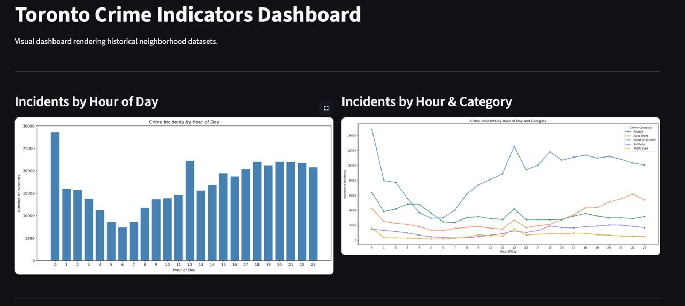
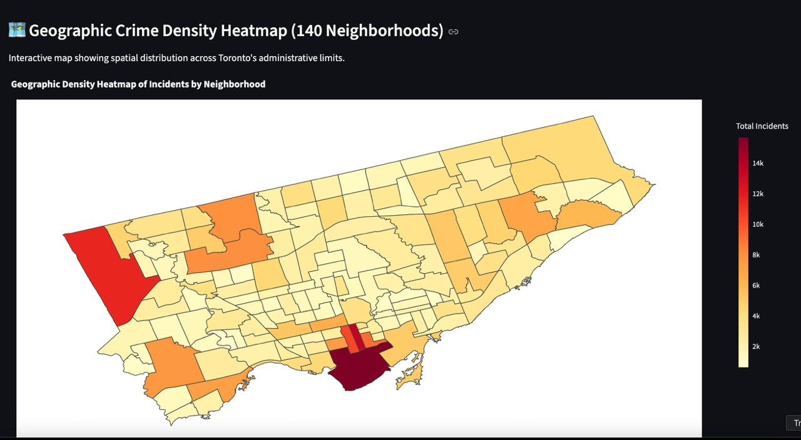
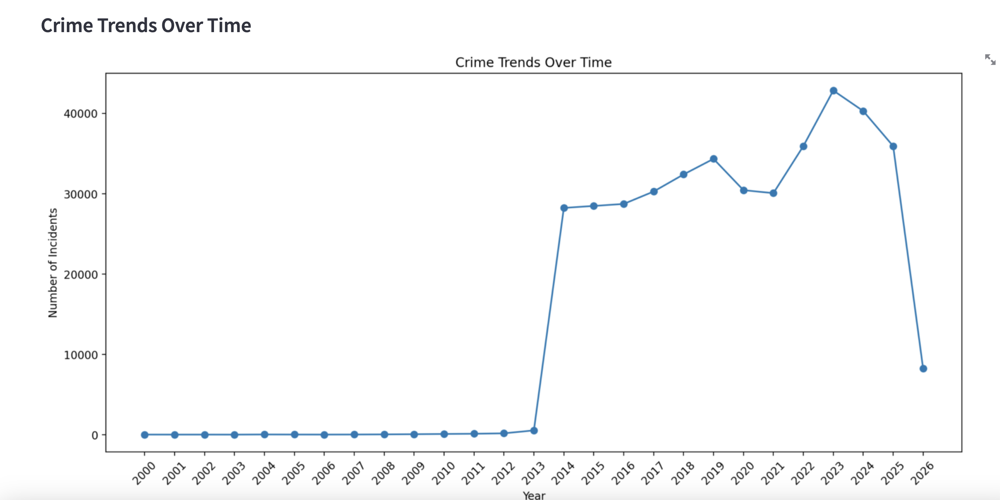
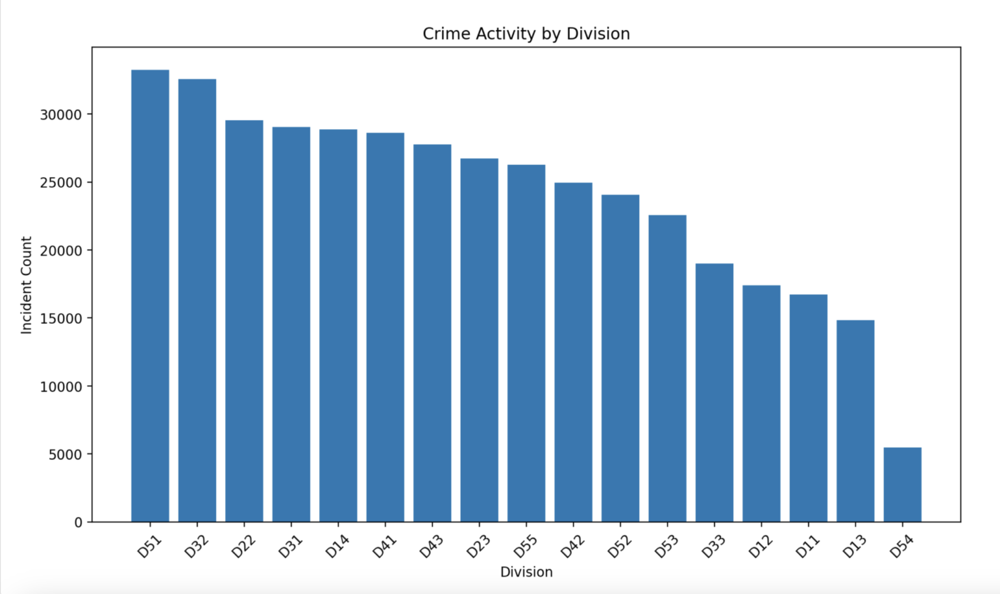
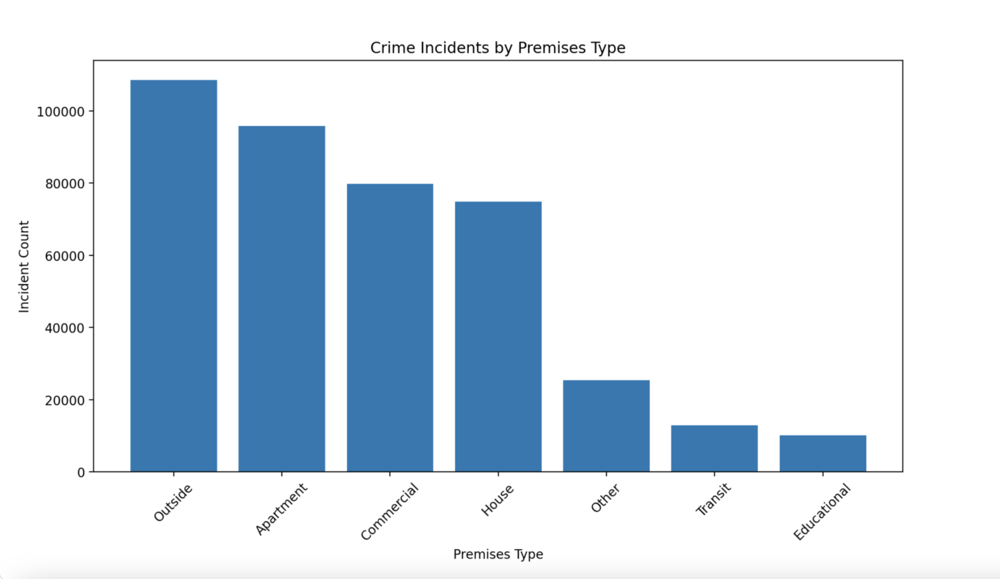
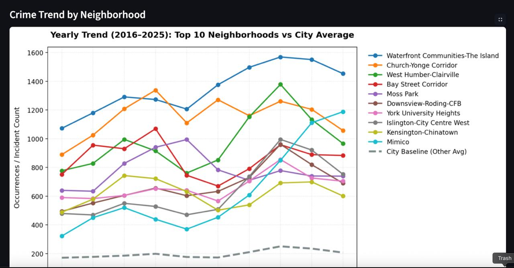
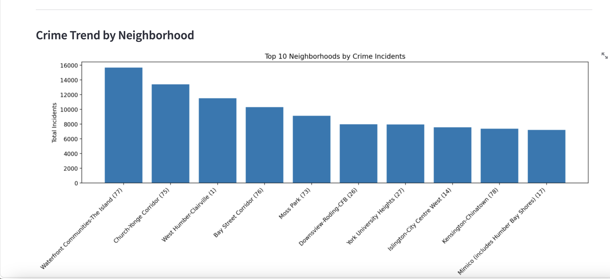

# 🚔 Toronto Crime Indicators Analytics Tool


A Python and Streamlit analytics application designed to transform large-scale Toronto crime data into interactive insights that support public safety planning and operational decision-making.

---

## 📌 Project Overview

This project analyzes **474,819 Toronto crime records** spanning **2014–2026** across **31 variables**.

The application enables users to explore crime trends, compare police division activity, analyse crime by premises type, and generate interactive visualisations through a Streamlit dashboard.

Developed using Agile Scrum practices, the project includes automated testing, modular Python development, and GitHub version control.

---

## 📑 Table of Contents

## Table of Contents

- Project Overview
- Business Problem
- Key Features
- Dashboard Preview
- Technologies Used
- Installation
- Testing
- Dataset
- Key Insights
- My Contributions
- Future Enhancements
- Contact

## 🎯 Business Problem

Public safety professionals and city stakeholders require an accessible way to:

- Monitor monthly and yearly crime trends
- Compare crime activity across police divisions
- Identify high-risk premises
- Support evidence-based policing and resource allocation

---

## ✨ Key Features

- Interactive Streamlit dashboard
- Crime trend analysis over time
- Police division activity analysis
- Premises type analysis
- Automated data cleaning
- Summary statistics
- Interactive visualisations
- Unit testing with PyTest

---

---

## 📸 Dashboard Preview

### Interactive Dashboard Overview

The Streamlit dashboard provides a visual interface for exploring hourly crime patterns, category-level trends, neighbourhood activity, police divisions, premises types, and geographic crime concentration.



### Geographic Crime Density Heatmap

The geographic heatmap displays the spatial distribution of reported incidents across Toronto neighbourhoods, enabling users to identify areas with higher incident concentrations.



### Crime Trends Over Time

This analysis tracks reported incidents by year and supports the identification of long-term changes in crime activity.



### Police Division Activity

The division analysis compares incident volumes across Toronto Police Service divisions to support workload assessment and operational planning.



### Incidents by Premises Type

This chart compares reported incidents across premises categories, including outdoor locations, apartments, commercial properties, houses, transit areas, and educational locations.



### Highest-Incident Neighbourhoods

The neighbourhood ranking highlights the ten Toronto neighbourhoods with the highest reported incident counts in the dataset.



### Neighbourhood Trends

This visual compares annual incident trends among the highest-incident neighbourhoods and the wider city baseline.



---

## 🛠️ Technologies Used

- Python
- Streamlit
- Pandas
- NumPy
- Matplotlib
- Plotly
- PyTest
- Git
- GitHub
  
---

# 📈 Project Statistics

- Dataset Size: **474,819 records**
- Variables: **31**
- Programming Language: **Python**
- Dashboard Framework: **Streamlit**
- Development Methodology: **Agile Scrum**
- Testing Framework: **PyTest**
  

## 📁 Project Structure

```text
toronto-crime-indicators-analytics-tool/

├── app.py
├── src/
├── tests/
├── assets/
├── data/
├── docs/
├── notebooks/
├── requirements.txt
└── README.md
```

---

# ⚙️ Installation

## Clone the Repository

```bash
git clone https://github.com/abetayonoah/toronto-crime-indicators-analytics-tool.git
```

## Navigate to the Project Directory

```bash
cd toronto-crime-indicators-analytics-tool
```

## Install Dependencies

```bash
pip install -r requirements.txt
```

## Run the Application

```bash
streamlit run app.py
```

The application will launch in your default web browser.

---

# 🧪 Testing

Run the automated unit tests using:

```bash
pytest
```

The test suite validates:

- Data loading
- Data cleaning
- Summary calculations
- Data aggregation logic

---

# 📊 Dataset

This project uses the **Toronto Crime Indicators** dataset published by the Toronto Police Service.

The original dataset is **not included** in this repository due to file size considerations.

Download the dataset from the official Toronto Police Open Data Portal and place it inside the `data` folder before running the application.

---

# 📈 Key Insights

The application enables users to:

- Monitor crime trends over time
- Compare activity across police divisions
- Analyse incidents by premises type
- Generate interactive visualisations
- Support evidence-based public safety planning

---

# 👤 My Contributions

As part of a collaborative Agile Scrum team, my primary contributions included:

- Designed and implemented crime trend analysis over time
- Developed police division activity analysis
- Built premises type analysis and visualisations
- Implemented modular Python components
- Contributed to automated testing
- Participated in Agile sprint planning and code reviews
- Assisted with project integration and documentation

---

# 🌐 Live Demo

Live Demo

https://toronto-crime-dashboard.streamlit.app

To explore the application locally:

```bash
streamlit run app.py
```

# 🚀 Future Enhancements

Future versions of the project may include:

- Interactive geographic crime maps
- Crime prediction using machine learning
- Real-time data integration
- User authentication
- Dashboard export functionality

---

# 📄 License

This project is provided for educational and portfolio purposes.

---

# 📬 Contact

**Tayo Abe**

- LinkedIn: https://www.linkedin.com/in/tayo-abe-4b0ab4389/
- GitHub: https://github.com/abetayonoah

---


